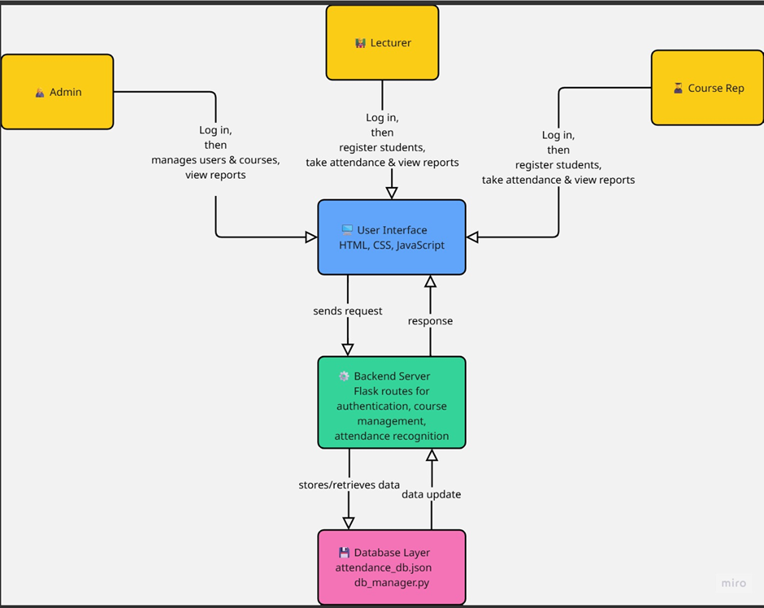
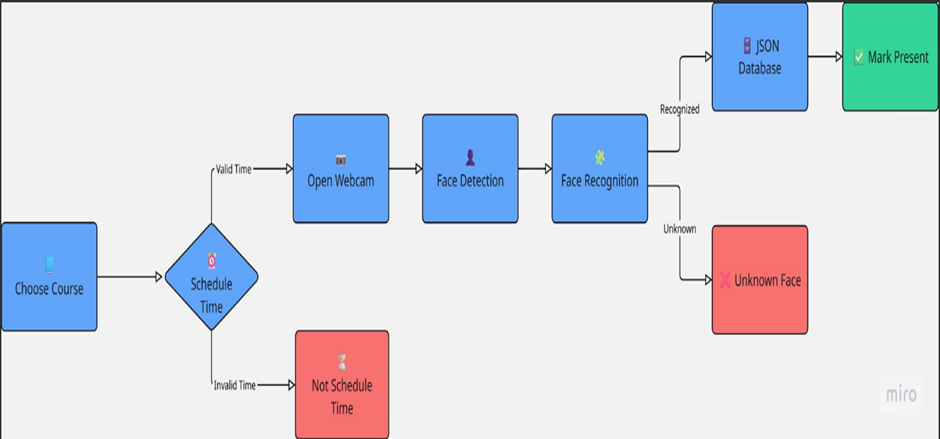
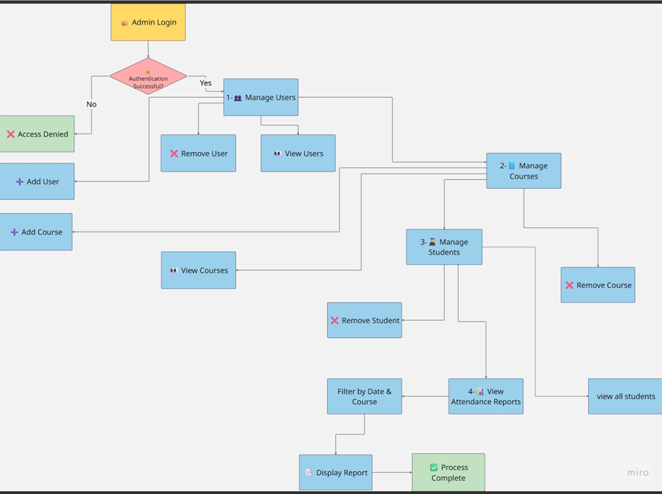
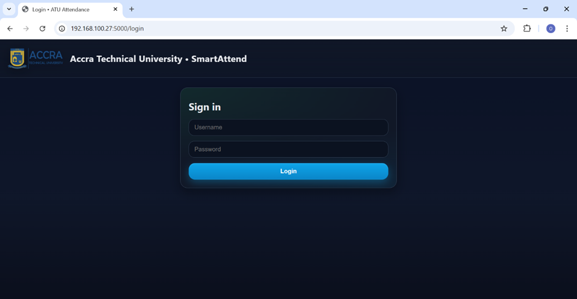
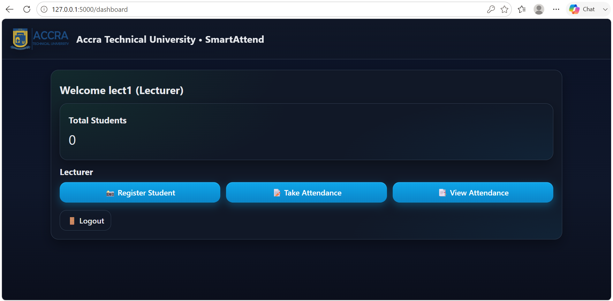
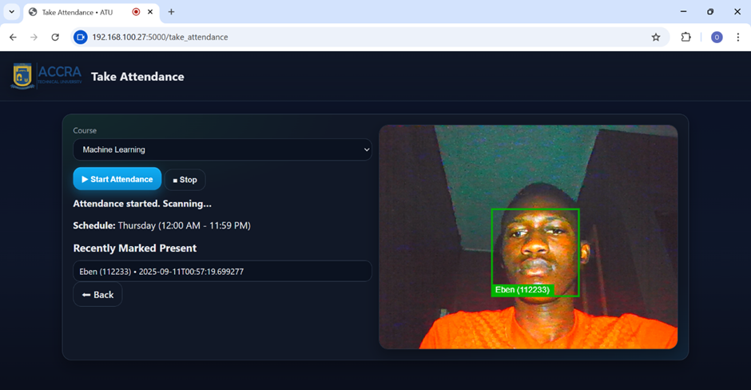
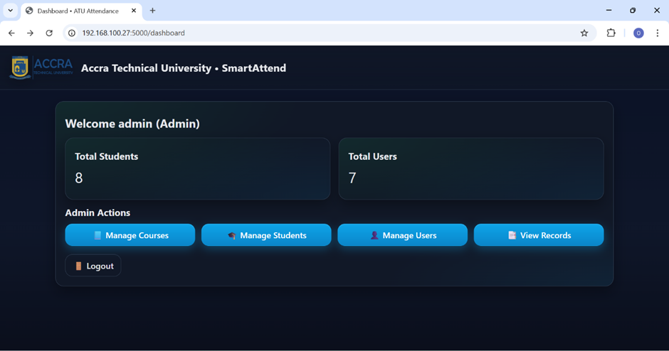

# SMART_ATTEND

A Flask-based Face Detection Attendance System developed for Accra Technical University.

---

## Project Overview

SMART_ATTEND is a web-based attendance management system that automates student attendance using facial recognition technology.

The system was developed to eliminate manual attendance processes by providing secure, accurate, and automated attendance recording. It uses OpenCV and the face_recognition library to detect and recognize students in real time.

The application supports three user roles:

- Administrator
- Lecturer
- Course Representative

It can operate in both offline mode and Local Area Network (LAN) mode.

---

## Features

- Face Detection using OpenCV
- Face Recognition using face_recognition
- Student Registration
- Automated Attendance Capture
- Role-Based Access Control (RBAC)
- Course Management
- Student Management
- Attendance Reports
- Offline Mode
- Local Area Network (LAN) Support
- Schedule Validation
- Secure User Authentication

---

## Technologies Used

| Technology | Description |
|------------|-------------|
| Python | Backend Programming Language |
| Flask | Web Framework |
| OpenCV | Face Detection |
| face_recognition | Facial Recognition |
| HTML | Frontend Structure |
| CSS | Styling |
| JavaScript | Client-side Programming |
| JSON | Local Database |

---

## System Architecture

### SMART_ATTEND SYSTEM ARCHITECTURE



### ATTENDANCE WORKFLOW WITH FACE RECOGNITION AND SCHEDULE VALIDATION



### ADMIN POWER IN SMART_ATTEND



---

## Folder Structure

```text
SMART_ATTEND/
│
├── server.py
├── db_manager.py
├── attendance_db.json
├── requirements.txt
├── README.md
├── static/
├── templates/
└── screenshots/
```

---

## Installation

Clone the repository

```bash
git clone https://github.com/ebencybersec/SMART_ATTEND.git
```

Move into the project

```bash
cd SMART_ATTEND
```

Install the required packages

```bash
pip install -r requirements.txt
```

Run the application

```bash
python server.py
```

Open your browser

```text
http://127.0.0.1:5000
```

---

## Screenshots

### Login Page



### Dashboard



### Attendance Page



### Administrator Dashboard



---

## Future Improvements

- Replace JSON with MySQL or PostgreSQL
- Docker deployment
- HTTPS support
- Mobile application
- Cloud deployment
- Analytics dashboard

---

## Author

Okumba-Mitchowanou Ebenisert-Bienvenu

Information Systems Technology

Accra Technical University

---

## License

This project was developed for educational purposes at Accra Technical University.
